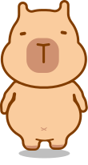

<div align="center">



# capy-ui

A cozy-themed React component library, built to make things cute while staying minimalistic.

[](https://blu-octopus.github.io/capy-ui/)
[](https://github.com/blu-octopus/capy-ui/actions/workflows/deploy-storybook.yml)
[](LICENSE)
[](https://www.figma.com/design/J8NYRY4863ADctpSJErZ25/Personal-Productivity-Capy-App)

**[👉 Browse the live Storybook](https://blu-octopus.github.io/capy-ui/)**

</div>

Every component is a faithful implementation of the [Personal Productivity Capy App Figma file](https://www.figma.com/design/J8NYRY4863ADctpSJErZ25/Personal-Productivity-Capy-App) — colors, typography, and hand-drawn strokes are pulled directly from the design, not approximated. If you're a **designer**, this repo is the reference for how your Figma work actually ships. If you're a **developer**, it's a ready-to-use, accessible component set you can install or fork.

## Contents

- [Stack](#stack)
- [Getting started](#getting-started)
- [For designers](#for-designers)
- [Components](#components)
- [Usage guidelines](#usage-guidelines)
- [Mobile & React Native](#mobile--react-native)
- [Contributing](#contributing)
- [License](#license)

## Stack

- **React 18** + **TypeScript**, strict mode on
- [**Base UI**](https://base-ui.com) (`@base-ui/react`) for accessible, unstyled interaction primitives (dialogs, checkboxes, tabs, switches, radio groups) — this library only supplies the look, Base UI supplies correct keyboard/screen-reader behavior
- **Storybook 8** for component development, visual testing, and documentation
- Plain **CSS Modules** + design-token **CSS variables** for styling — no CSS-in-JS, no Tailwind, so anything here is easy to read and easy to fork
- **No d3, no animation library.** Hand-drawn geometry ([`src/sketch`](src/sketch)), chart axis ticks, and every micro-animation are hand-rolled with plain math and CSS — see [Mobile & React Native](#mobile--react-native) for why that matters here specifically

## Getting started

```bash
git clone https://github.com/blu-octopus/capy-ui.git
cd capy-ui
npm install
npm run storybook
```

Storybook launches automatically at **[localhost:6006](http://localhost:6006)**. Use the **CozyUI** sidebar group — grouped by what you'd actually reach for (**Foundations, Controls, Speech Bubbles, Timer, Coins & Purchases, Progress & Stats, Overlays, Brand**), not by how it's built — to browse every component. Start at **CozyUI/Overview** for every component on one scannable page (colors included), or open an individual story to see its states/variants side by side.

Don't want to install anything? The same Storybook is **[hosted on GitHub Pages](https://blu-octopus.github.io/capy-ui/)** and redeploys automatically on every push to `main` via [`.github/workflows/deploy-storybook.yml`](.github/workflows/deploy-storybook.yml).

Other scripts:

| Command | What it does |
|---|---|
| `npm run storybook` | Local dev server with hot reload |
| `npm run build-storybook` | Static Storybook build (what gets deployed to Pages) |
| `npm run typecheck` | Strict `tsc --noEmit` pass — run this before opening a PR |

## For designers

- **Source of truth:** the [Figma file](https://www.figma.com/design/J8NYRY4863ADctpSJErZ25/Personal-Productivity-Capy-App) is canonical. Every component here was built by pulling that file's exact colors, type, spacing, and vector artwork — nothing was eyeballed or approximated from a screenshot.
- **Design tokens map 1:1 to Figma variables.** [`tokens.css`](src/components/cozy-ui/tokens.css) holds every color, font, and stroke width as a CSS custom property, named to match the Figma variable it came from (e.g. `--color-brand-brown`, `--font-display`, `--stroke-width-2`). Change a value in Figma, update it here, and every component picks it up — no hunting through individual files.
- **The "hand-drawn" look is generated geometry, not a filter or a baked-in image.** Figma's "Dynamic Stroke" wobble is reproduced by a small procedural engine in [`src/sketch`](src/sketch): it samples a shape's boundary, perturbs both its position and width with seeded noise, and emits a plain SVG path (see [`Bubble.tsx`](src/components/cozy-ui/atoms/Bubble/Bubble.tsx) or [`WobbleBorder.tsx`](src/components/cozy-ui/WobbleBorder.tsx)). Same seed always reproduces the same wobble, and the output is just a path string — it renders identically through a browser `<path>` or React Native's `<Path>`. The one exception is [`Text.tsx`](src/components/cozy-ui/atoms/Text/Text.tsx)'s dynamic-stroke variants, which still use a live `feTurbulence`/`feDisplacementMap` filter — there's no boundary to offset for glyphs that are already rendered text — and are explicitly documented web-only for that reason.
- **Everything is organized by [atomic design](https://atomicdesign.bradfrost.com/)** — `atoms/`, `molecules/`, and `organisms/` — mirroring how small pieces (a `Button`, an `icon`) combine into bigger ones (a `Modal`, a `TrendCard`). If you're proposing a new pattern, think about which layer it belongs to before it's built.
- **Filing a design change:** open an issue linking the exact Figma node (right-click → **Copy link to selection**) and describe what changed — color, spacing, a new state — so it can be diffed directly against the token/component that needs updating.

## Components

All components live under [`src/components/cozy-ui`](src/components/cozy-ui), organized into `atoms/`, `molecules/`, and `organisms/` per [Brad Frost's atomic design system](https://atomicdesign.bradfrost.com/) (grouped by actual composition, not just visual complexity), and are re-exported from its [`index.ts`](src/components/cozy-ui/index.ts), so consumers can do:

```tsx
import { Button, Checkbox, DialogueBubble } from 'capy-ui/src/components/cozy-ui';
```

Every component has a co-located `.stories.tsx`. The tables below are organized by folder — `atoms/`, `molecules/`, `organisms/` — but the **Story** links point at Storybook's own navigation, which is deliberately grouped differently: by what you'd reach for (Foundations, Controls, Speech Bubbles, Timer, Coins & Purchases, Progress & Stats, Overlays, Brand), not by how each thing is built. Folder tier and sidebar group are two separate concerns on purpose — see [`CozyUI/Overview`](https://blu-octopus.github.io/capy-ui/?path=/story/cozyui-overview--all-components) for everything on one page.

### Atoms

| Component | Story |
|---|---|
| [Text](src/components/cozy-ui/atoms/Text) (type scale + dynamic-stroke wobble) | [Storybook](https://blu-octopus.github.io/capy-ui/?path=/story/cozyui-foundations-text--type-scale) |
| [Button](src/components/cozy-ui/atoms/Button) | [Storybook](https://blu-octopus.github.io/capy-ui/?path=/story/cozyui-controls-button--all-variants) |
| [Bubble](src/components/cozy-ui/atoms/Bubble) | [Storybook](https://blu-octopus.github.io/capy-ui/?path=/story/cozyui-speech-bubbles-bubble--default) |
| [Checkbox](src/components/cozy-ui/atoms/Checkbox) | [Storybook](https://blu-octopus.github.io/capy-ui/?path=/story/cozyui-controls-checkbox--default) |
| [Toggle](src/components/cozy-ui/atoms/Toggle) | [Storybook](https://blu-octopus.github.io/capy-ui/?path=/story/cozyui-controls-toggle--default) |
| [Favicon](src/components/cozy-ui/atoms/Favicon) | [Storybook](https://blu-octopus.github.io/capy-ui/?path=/story/cozyui-brand-favicon--sizes) |
| [CapyMascot](src/components/cozy-ui/atoms/CapyMascot) (+ `CapyMascotHead`/`CapyMascotBody`) | [Storybook](https://blu-octopus.github.io/capy-ui/?path=/story/cozyui-brand-capymascot--both-variants) |
| [ProgressRing](src/components/cozy-ui/atoms/ProgressRing) (animates in) | [Storybook](https://blu-octopus.github.io/capy-ui/?path=/story/cozyui-progress-stats-progressring--default) |
| [Locked](src/components/cozy-ui/atoms/Locked) | [Storybook](https://blu-octopus.github.io/capy-ui/?path=/story/cozyui-brand-locked--default) |
| [icons](src/components/cozy-ui/atoms/icons) (stats, return, restart, play, pause, skip, back, next) | [Storybook](https://blu-octopus.github.io/capy-ui/?path=/story/cozyui-foundations-icons--all-icons) |
| [BatteryIndicator](src/components/cozy-ui/atoms/BatteryIndicator) | [Storybook](https://blu-octopus.github.io/capy-ui/?path=/story/cozyui-progress-stats-batteryindicator--all-variants) |

### Molecules

| Component | Story |
|---|---|
| [CoinWallet](src/components/cozy-ui/molecules/CoinWallet) (+ `Coin`) | [Storybook](https://blu-octopus.github.io/capy-ui/?path=/story/cozyui-coins-purchases-coinwallet--grows-with-digit-count) |
| [ColorPicker](src/components/cozy-ui/molecules/ColorPicker) | [Storybook](https://blu-octopus.github.io/capy-ui/?path=/story/cozyui-controls-colorpicker--default) |
| [DailyStreaks](src/components/cozy-ui/molecules/DailyStreaks) | [Storybook](https://blu-octopus.github.io/capy-ui/?path=/story/cozyui-progress-stats-dailystreaks--default) |
| [DialogueBubble](src/components/cozy-ui/molecules/DialogueBubble) | [Storybook](https://blu-octopus.github.io/capy-ui/?path=/story/cozyui-speech-bubbles-dialoguebubble--width-tracks-content) |
| [Field](src/components/cozy-ui/molecules/Field) | [Storybook](https://blu-octopus.github.io/capy-ui/?path=/story/cozyui-controls-field--default) |
| [TimeTabs](src/components/cozy-ui/molecules/TimeTabs) | [Storybook](https://blu-octopus.github.io/capy-ui/?path=/story/cozyui-timer-timetabs--default) |
| [TimerToggle](src/components/cozy-ui/molecules/TimerToggle) | [Storybook](https://blu-octopus.github.io/capy-ui/?path=/story/cozyui-timer-timertoggle--count-up) |
| [TimerClock](src/components/cozy-ui/molecules/TimerClock) (real ticking count up/down, not a one-shot animated counter) | [Storybook](https://blu-octopus.github.io/capy-ui/?path=/story/cozyui-timer-timerclock--with-controls) |

### Organisms

| Component | Story |
|---|---|
| [Modal](src/components/cozy-ui/organisms/Modal) | [Storybook](https://blu-octopus.github.io/capy-ui/?path=/story/cozyui-overlays-modal--default) |
| [InAppPurchaseCard](src/components/cozy-ui/organisms/InAppPurchase) | [Storybook](https://blu-octopus.github.io/capy-ui/?path=/story/cozyui-coins-purchases-inapppurchasecard--all-tiers) |
| [TrendCard](src/components/cozy-ui/organisms/TrendCard) | [Storybook](https://blu-octopus.github.io/capy-ui/?path=/story/cozyui-progress-stats-trendcard--grid) |
| [PieChart](src/components/cozy-ui/organisms/PieChart) (hover/press tooltip, percent legend) | [Storybook](https://blu-octopus.github.io/capy-ui/?path=/story/cozyui-progress-stats-piechart--with-interaction) |
| [BarChart](src/components/cozy-ui/organisms/BarChart) (hover/press tooltip, nice axis ticks) | [Storybook](https://blu-octopus.github.io/capy-ui/?path=/story/cozyui-progress-stats-barchart--with-interaction) |

> Swap `blu-octopus.github.io/capy-ui` for `localhost:6006` in any link above to open the same story against a local `npm run storybook`.

## Usage guidelines

**Design tokens.** [`tokens.css`](src/components/cozy-ui/tokens.css) defines every color, font, and stroke width as a CSS custom property (`--color-brand-brown`, `--font-display`, `--stroke-width-2`, …). Style against these variables, never a hardcoded hex or `font-family` — it's the only thing keeping every component visually consistent with the Figma file if the palette ever changes. `.storybook/preview.ts` imports `tokens.css` globally for Storybook; a consuming app needs to import it once too.

**Base UI state, not custom state.** Interactive components wrap a Base UI primitive (`Checkbox.Root`, `Switch.Root`, `Tabs.Root`, `Dialog.Root`, `RadioGroup`, `Field.Root`) rather than reimplementing checked/open/selected logic. Visual states are driven by the `data-*` attributes Base UI already puts on the DOM node (`[data-checked]`, `[data-active]`, …) — check the relevant `*.module.css` file for the mapping before assuming a new state attribute exists; Base UI's naming isn't always the one you'd guess (e.g. the selected Tab gets `data-active`, not `data-selected`).

**Hand-drawn artwork is generated, never hand-coded.** Static hand-drawn shapes (icons, coins, the lock, the capybara mascots, the battery indicator, the favicon) are real SVGs exported from Figma, cleaned up, and turned into `.tsx` files by a script in [`scripts/`](scripts) (`build-icons.mjs`, `build-favicon.mjs`, `build-battery.mjs`, `build-misc-icons.mjs`). **Never hand-edit a generated component** — the header comment says so for a reason; if the Figma artwork changes, re-run the matching script, and if you need a new hand-drawn asset, add it to the relevant `assets/` folder and extend the script rather than transcribing paths by hand. Shapes that need to resize on the fly instead (`Bubble`'s outline, `DialogueBubble`'s tail, every card's `WobbleBorder`) call the procedural generator in [`src/sketch`](src/sketch) — see [For designers](#for-designers) above, and [Mobile & React Native](#mobile--react-native) below for why it's built that way specifically.

**Charts replicate Figma's data, not live data, but are fully interactive.** `PieChart` and `BarChart` take a `data` prop — the default values in their stories were reverse-engineered from the wedge angles / bar heights in the Figma vectors so the demo matches the mock, but both components are generic and take any dataset. Both hover (desktop) and tap-to-pin (touch — tap a wedge/bar to pin its tooltip open, tap again or elsewhere to dismiss) drive a shared floating [`ChartTooltip`](src/components/cozy-ui/ChartTooltip.tsx), and both expose `onSliceHover`/`onSliceClick` (`PieChart`) or `onBarHover`/`onBarClick` (`BarChart`) so a host app can wire up drill-down behavior. `BarChart`'s y-axis ticks are picked by [`chartTicks.ts`](src/components/cozy-ui/chartTicks.ts), a small reimplementation of d3-scale's "nice round number" algorithm (no d3 dependency) — pass `max` explicitly to override it. Note: the pie chart's categorical palette is Figma's own secondary/pastel color tokens, which fail colorblind-safety validation (grey vs. red sit well below the safe separation floor) — this wasn't fixed by silently repainting the brand colors; see the comment in `PieChart.stories.tsx` before reusing that palette elsewhere.

**Adding a new component.** Follow the order in [`CLAUDE.md`](CLAUDE.md): pull the node's design context from Figma first, reuse tokens instead of new hex values, build the simplest primitive before composing it into something bigger, decide which atomic-design tier it belongs in, and give it a `.stories.tsx` that's screenshotted against the Figma reference before calling it done.

## Mobile & React Native

This library's next stop is a React Native Pomodoro app, shipped to app stores — a couple of decisions follow directly from that, and matter if you're extending it:

- **No SVG filters outside `Text`.** `react-native-svg` doesn't implement `feTurbulence`/`feDisplacementMap`, so every hand-drawn shape except live text uses the procedural path generator in [`src/sketch`](src/sketch) instead (see [For designers](#for-designers) above) — the exact same function call renders on web and native, no platform branch needed.
- **Touch targets clear ~44px even where the visual doesn't.** `Checkbox`, `Toggle`, and `Button` keep their exact Figma-specified visual size but sit inside an invisible, absolutely-positioned hit-area sized to the accessible minimum (`::after` in each `.module.css`) — it doesn't affect layout, so it's safe even inside a dense grid like `DailyStreaks`. `ColorPicker`'s swatches sit too close together for that trick without their hit-areas overlapping each other, so they're sized up directly (20px, up from Figma's 12px) instead.
- **Charts are fluid, not fixed-pixel.** `BarChart`'s SVG renders at `width: 100%` against its `viewBox` rather than a hardcoded pixel width, so it shrinks to fit a narrow screen instead of overflowing; its hover/press tooltip converts coordinates through that same scale factor so it still lands in the right place at any size.
- **`Field`'s input jumps to 16px font-size on touch devices** (`@media (pointer: coarse)`) — anything smaller makes iOS Safari zoom the whole page in on focus. Desktop keeps the denser 12px Figma spec.
- **Every hover state has a tap equivalent.** `PieChart`/`BarChart` respond to hover on desktop and tap-to-pin on touch — see [Usage guidelines](#usage-guidelines) above.

## Contributing

Issues and PRs are welcome, from a one-character typo fix to a whole new component.

1. **Fork and clone**, then `npm install` and `npm run storybook` to confirm everything renders before you start.
2. **Match the existing patterns** rather than introducing a new one: CSS Modules + tokens (not Tailwind or CSS-in-JS), Base UI for any interactive/accessible behavior, generator scripts for static hand-drawn assets. See [Usage guidelines](#usage-guidelines) above and [`CLAUDE.md`](CLAUDE.md) for the full house style.
3. **New components** go under `src/components/cozy-ui/{atoms,molecules,organisms}/<Name>` (pick the tier based on what it composes — see [Components](#components)), need a co-located `.stories.tsx`, and get re-exported from [`index.ts`](src/components/cozy-ui/index.ts).
4. **Before opening a PR:** run `npm run typecheck` and `npm run build-storybook` locally — both must pass clean. If you touched anything visual, include a before/after screenshot from Storybook in the PR description.
5. **Keep PRs scoped** — one component or one fix per PR is much easier to review than a bundle of unrelated changes.

Design-only contributions (color/spacing/copy tweaks sourced from Figma) are just as welcome as code — see [For designers](#for-designers) above for how to file one.

## License

[MIT](LICENSE) © blu-octopus
